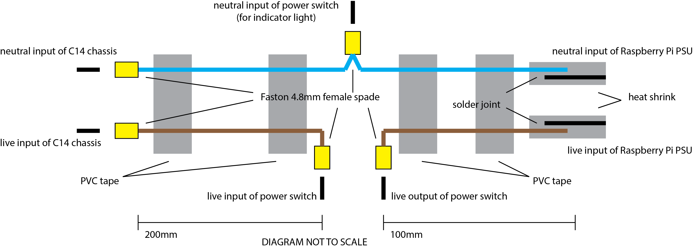

# Quasar Box

The Quasar Box is custom made lighting controller with DMX output. It uses a Raspberry Pi running QLC+ with a BitWizard DMX output board. This is all contained with power supply in a rugged box for easier use at events and installations.

## Connections

The Quasar Box has various connection points. These are all mounted on the same side to make patching and cable management easier.

Connection  | Type             | Use
------------|------------------|----
Power Input | C14 Socket       | Provide 240V AC mains power using a C13 cable.
DMX Output  | XLR 3 Pin Female | Output DMX lighting control signal over the industry standard connection
Network     | RJ45             | Connect to a computer network to allow use of the lighting control software’s web interface and remote support features
Display     | HDMI             | Connect a digital monitor to operate the lighting control software
Peripherals | USB x 2          | Connect USB peripherals such as computer mice, keyboards and other controllers
Accessories | DIN 8 pin        | Connect custom made accessories such button boxes and relay controllers

Before switching the Quasar Box on, check that all necessary cables are connected. Ensure the power cable is correctly connected and the DMX and network cable are plugged in. If a display, peripherals or accessories are being used ensure they are connected too.

### Red Power Switch

The red power switch is used to turn to the box on and off. Switch it to the on position and it will illuminate to indicate the box is powered correctly. The box will then begin to start up. If a screen is connected you will see various startup messages.

### Green Utility Button

Once the lighting software has started the green utility button will illuminate. It can be used to restart the lighting control software in order to reset to it’s default state. If held the button will begin to flash, once held for 3 seconds the button will flash more rapidly to indicate it can be released and the software will restart.

## Operation

Now that the lighting control software is running, any connected lighting should be receiving DMX or other protocols. The software will load the lighting workspace file for your event or installation and put the lighting into it’s programmed starting state.

You can now operate the lights as required. How this is done will depend on your control hardware setup:
If a screen is connected you will see your virtual console, which can be controlled using a computer mouse, keyboard or other USB controllers.

*  If your box is connected to a network you can see your web console by entering the box’s IP address into a web browser on a laptop or phone that is also connected to that network.

*  If you have a button box you can now use the buttons to trigger different lighting effects.

As every lighting workspace is different, and hardware control setups can vary, a separate user guide should have been provided for your event or installation. Please refer to this for specific details about how your lighting is programmed and operated.

## Technical Information

### Hardware

Internally the Quasar Box uses a Raspberry Pi micro computer to run the lighting control software: https://www.raspberrypi.org/

A BitWizard DMX board is used to output lighting control signal: http://bitwizard.nl/shop/DMX-interface-for-Raspberry-pi

These are securely mounted in a black plastic box that measures 220 x 150 x 64mm. The internal hardware is available for anyone to buy and use and we encourage people to explore them; the box is simply intended to be a rugged and simplified container for this hardware.

### Software

The lighting control software used is QLC+, which is a free and open source program: http://www.qlcplus.org/ 

While QLC+ is open source software and therefore comes with no guarantee, we make sure to test new versions before updating our devices. We prefer using open source software as it allows much greater flexibility. In particular QLC+ is incredibly flexible and robust, allowing for very complicated lighting control setups to be programmed with very easy to use controls. Furthermore it removes the difficulty and worry of software licensing as it is licensed for anyone to use and modify, including for commercial use. QLC+ also runs on macOS and Windows so can be used on any computer.

In addition to QLC+ we have also created various extra programs to help make use and configuration of the boxes easier.

## The Stage Bus version

The Stage Bus have a custom version of the Quasar Box, which uses a different power input to the standard version. Rather than a C14 socket being used to supply the box with 240V AC mains power, a Speakon NL4 socket is used to provide 24V DC. This allows the box to be powered directly from the vehicles’ batteries, improving efficiency and avoiding the need for an inverter.

The Speakon NL4 is wired with 24V connected to the 2+ terminal and 0V wired to the 1- terminal. Inside the box the standard Raspberry Pi 5V DC power supply is replaced with a 24V DC to 5V DC converter with a 3A rating.

## Parts List

**All part costs were correct at the time of design and should be used for cost estimation only.**

### Functional parts

These are the main parts that will be needed to build one Quasar box.

Item                     | Quantity 
-------------------------|----------
Raspberry Pi 3           | 1        
Raspberry Pi PSU         | 1        
SanDisk 16GB micro SD    | 1        
BitWizard DMX            | 1        
C14 Chasis               | 1        
Illuminated Power Switch | 1        
Green Button             | 1        

Note that the C14 chassis is included as a functional part rather than an enclosure part. This is because even if a different enclosure was used it would still be needed for the PSU to be fitted inside the enclosure.

### Enclosure parts

These are the parts of the enclosure that will be needed to build one Quasar box.

Item                  | Quantity 
----------------------|----------
Box                   | 1        
XLR Chassis           | 1        
XLR Plug              | 1        
HDMI Chassis          | 1         
HDMI Cable 0.15m      | 1        
RJ45 Chassis          | 1        
RJ45 Cat5E Cable      | 1        
USB Dual Chassis      | 1        
USB Dual Header Cable | 1        

### Stage Bus version parts

These are main parts used in the Stage Bus version of the Quasar box. They replace the C14 chassis and Raspberry Pi PSU.

Item                                | Quantity 
------------------------------------|----------
24V DC to 5V DC Micro USB Converter | 1        
Speakon Chassis                     | 1        

### Custom Parts

These are the custom made parts needed to build one Quasar box.

Item                                                     | Quantity
---------------------------------------------------------|----------
GPIO header to 8 pin DIN socket cable                    | 1
GPIO header to Faston female 4.8mm female spades         | 1
XLR 3 pin plug to XLR 3 pin socket cable                 | 1
Faston 4.8mm female spade pair to Raspberry Pi PSU cable | 1

#### GPIO Header to 8 Pin DIN Socket Cable

This cable allows the Raspberry Pi’s GPIO connectors to be used with external hardware, for example as input for custom buttons or output to switch relays.

DIN | Pysical | BCM
----|---------|----
1   | 35      | 19
2   | 31      | 6
3   | 36      | 16
4   | 33      | 13
5   | 32      | 12
6   | 37      | 26
7   | 38      | 20
8   | 40      | 21
GND | 34      | n/a
GND | 39      | n/a

#### GPIO Header to Faston Female 4.8mm Spades

Function | Physical | BCM
---------|----------|-----
INPUT    | 29       | 5
OUTPUT   | 27       | 0
GND      | 30       | n/a

#### XLR 3 Pin Plug to XLR 3 Pin Socket Cable

This cable provides a chassis mount XLR 3 pin female which can be mounted to the outside of the box and plug into the BitWizard DMX output board mounted inside the box.

#### Faston 4.8mm Female Spades to Raspberry Pi PSU Cable

This cable connects the C14 chassis mount to the Raspberry Pi official power supply unit, via an illuminated power switch.

### Secondary Parts

These are secondary parts which are generally bought in bulk to make a batch of Quasar boxes.

Item                                           | Quantity 
-----------------------------------------------|----------
DMX Cable 1m                                   | 0.3
Faston 4.8mm Female Insulated                  | 2
power cable 0.75mm2 flex blue 0.3m             | 1
power cable 0.75mm2 flex brown 0.3m            | 1
dupont female                                  | 0
dupont female housing 5 pin                    | 0
dupont female housing 5 pin                    | 0
wire black                                     | 1
faston 4.8mm female insulated                  | 12
M3 hex countersunk black bolt                  | 1
M3 nylon lock nut                              | 10
M2.5 hex countersunk black bolt                | 4
M2.5 plastic hex riser 5mm female to 6mm male  | 4
M2.5 plastic hex riser 20mm female to 6mm male | 4
M2.5 plastic hex riser 10mm female to female   | 4
M4 hex countersunk black bolt 30mm             | 1
M4 nylon lock nut                              | 1
